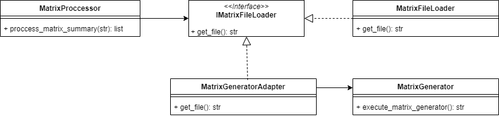

s# Introduction

This project is an example of adapter template usage.

## Execution
    
Execution:
   
    python src/main.py

## Testing
 
Execution:
 
    python tests/tests.py
        
## Classes diagram
