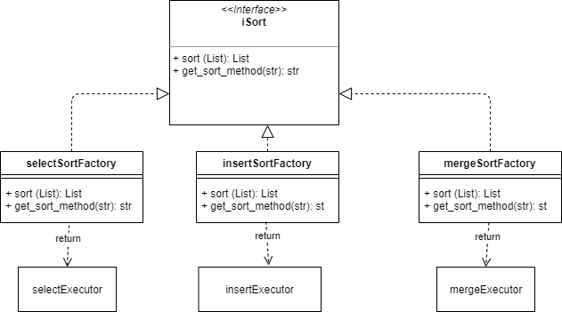

# Introduction

This project is an example of factory template usage.

## Execution

View help:
   
    python main.py -h
    
Execution:
   
    python main.py sort_method path_to_input_folder path_to_output_folder

## Testing
 
 Run python code from 'tests' directory:
 
        python -m unittest tests
        
## Classes diagram
