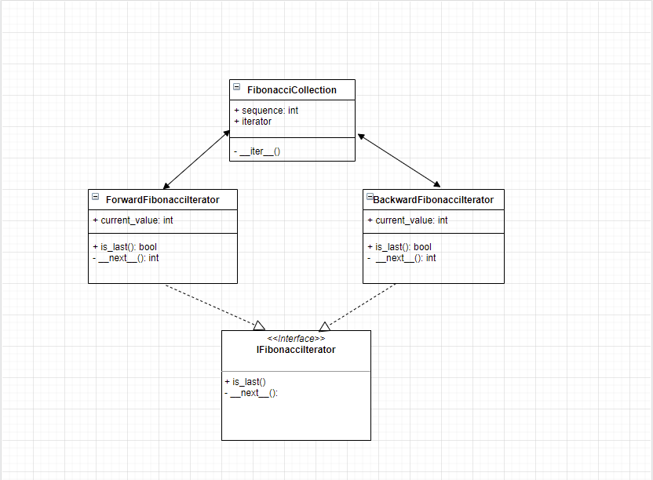

# Introduction

This project is an example of iterator template.

## Execution

View help:
   
    python main.py -h
    
Execution:
   
    python main.py fibonacci_sequence output_file reverse

## Testing
 
Execution:
 
     python tests/tests.py 
        
## Classes diagram
