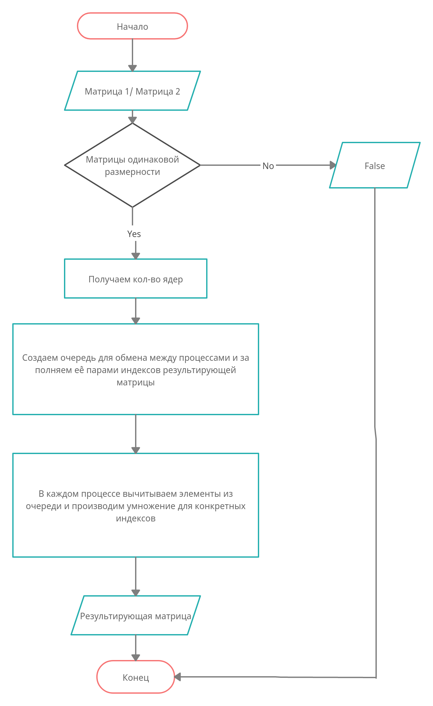

# Introduction

This project is an example of parallelism calculation in python.

## Execution

Run python code:
   
    python main.py
    

## Testing
 
Execution:
 
    python tests.py 
        
## Actions diagram
