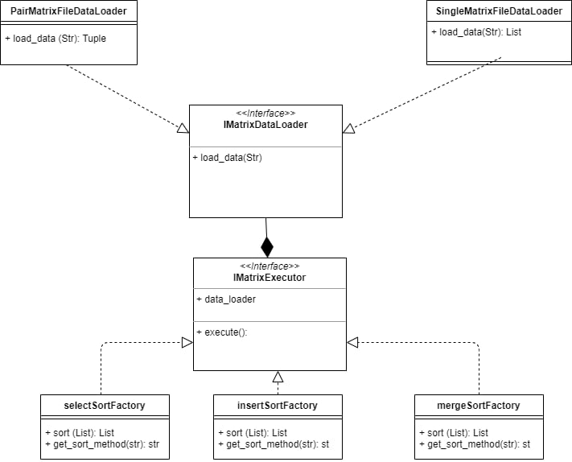

# Introduction

This project is an example of parallelism calculation in python.

## Execution

View help:
   
    python main.py -h
    
Execution:
   
    python main.py operation_method path_to_input_file path_to_output_file
    

## Testing
 
Execution:
 
    python tests.py 
        
## Actions diagram
